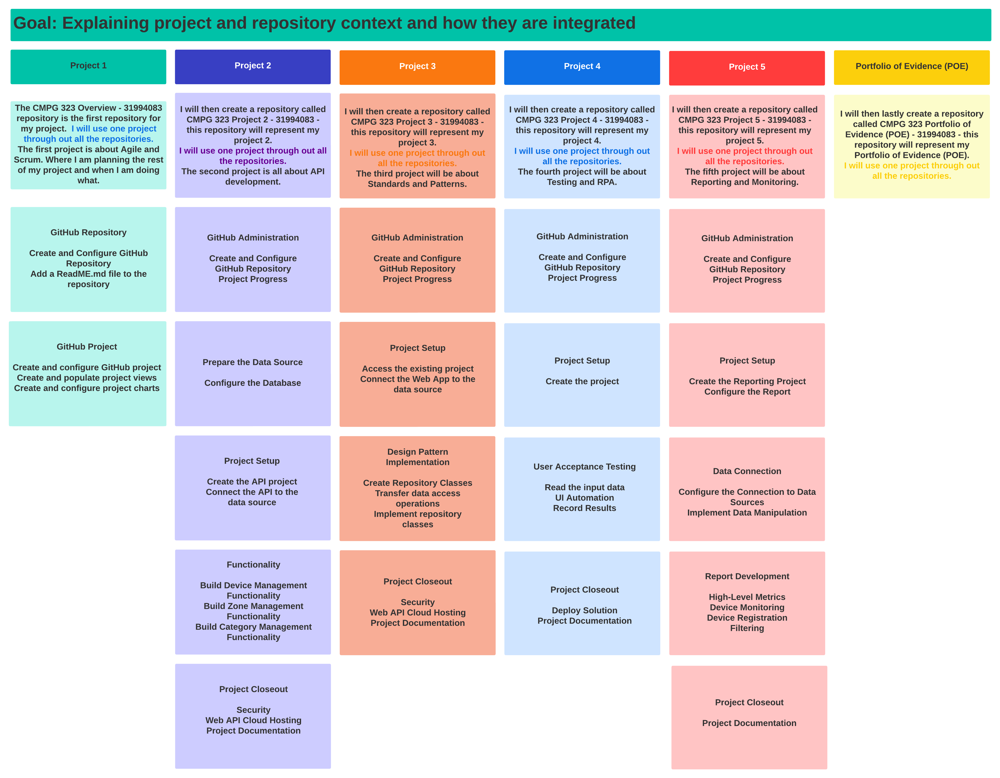

# CMPG-323-Overview-31994083

## Requirements:
All students enrolled in the CMPG 323 module will be growing and enhancing skills across different concepts, tools and technology stacks. Due to the nature of CMPG 323, planning will form a crucial part of the module as it will guide all students towards allocation of time to the tasks to be completed throughout the semester. As such, including all work and scoping it accurately will form an important part of the foundation for succeeding in the module. Functional requirements refer to the functionality that a system must have and how the functions should be performed. Non-functional requirements refer to the aspects of a solution that have an impact on the quality attributes of a system (or platform). These non-functional requirements are deemed as supportive requirements to ensure that the functional requirements are implemented appropriately and according to good software practices.

## Which repositories will be created and used for each project?
The CMPG 323 Overview - 31994083 repository is the first repository for my project. This is the repository I created for project 1. 
The first project is about Agile and Scrum. Where I am planning the rest of my project and when I am doing what.

I will then create a repository called CMPG 323 Project 2 - 31994083 - this repository will represent my project 2. 
The second project is all about API development.

I will then create a repository called CMPG 323 Project 3 - 31994083 - this repository will represent my project 3. 
The third project will be about Standards and Patterns.

I will then create a repository called CMPG 323 Project 4 - 31994083 - this repository will represent my project 4. 
The fourth project will be about Testing and RPA.

I will then create a repository called CMPG 323 Project 5 - 31994083 - this repository will represent my project 5. 
The fifth project will be about Reporting and Monitoring.

I will then lastly create a repository called CMPG 323 Portfolio of Evidence (POE) - 31994083 - this repository will represent my Portfolio of Evidence (POE). 
In this POE I will provide proof of additional training through badges and certifications obtained, 
provide proof of profile creation and community connection (LinkedIn, GitHub, UiPath Forum, Microsoft Forum, etc.), 
provide proof of contribution to forums and communities, 
project submissions, 
continuity of progress throughout the semester and 
attendance and contribution to classes.

## Diagram explaining project and repository context and how they are integrated:

## The branching strategy to be used within each project:
What is a branch? 
Branches allow you to develop features, fix bugs, or safely experiment with new ideas in a contained area of your repository. reference: [About branches](https://docs.github.com/en/pull-requests/collaborating-with-pull-requests/proposing-changes-to-your-work-with-pull-requests/about-branches)
It is great to use branches to test new ideas without messing up any code in the Master Branch, when you are happy with the ideas you did on the branches you can merge it to the Master Branch.

Throughout this project, I don't have a branching strategy.

## Explain the use of a .gitignore file within each project:
What is a .gitignore file?
A . gitignore file is a plain text file where each line contains a pattern for files/directories to ignore. reference: [How to Use a .gitignore File](https://www.pluralsight.com/guides/how-to-use-gitignore-file)
The purpose of gitignore files is to ensure that certain files not tracked by git remain untracked. reference: [Stackoverflow](https://stackoverflow.com/questions/13675216/why-should-i-use-gitignore#:~:text=on%20this%20post.-,The%20purpose%20of%20gitignore%20files%20is%20to%20ensure%20that%20certain,tracked%20by%20git%20remain%20untracked.&text=Say%20you%20run%20git%20add,you%20were%20mentally%20ignoring%20before.)

In each project (project 1 - project 5), I will make use of a .gitignore file, to make sure if I do a git commit, it updates only the necessary.

## Explain the storage of credentials and sensitive information:
The mistake that many programmers (even experienced ones) make is to store secrets together with their code, checking them into source control (like Git). This is certainly the easiest, most convenient way to deal with the problem, but it’s a rather bad idea. The most immediate reason why is connected to security. Source code repositories are meant to be shared, with your teammates, your company, or possibly with the entire world (as is the case for open source software). reference: [With Blue Ink](https://withblue.ink/2021/05/07/storing-secrets-and-passwords-in-git-is-bad.html)
I can invalidate tokens and passwords. If I don't want anyone even GitHub to have access to my code, or if regulations require it, Use GitHub Enterprise's on perm-offering. reference: [10 GitHub Security Best Practices](https://snyk.io/blog/ten-git-hub-security-best-practices/)
I can disable forking, 
Disable visibility changes, 
Enforce 2-factor authentication, 
Limit access to allowed IP addresses, 
Revoke permissions in a timely manner, 
Require commit signing and 
Enforce code review before commit. reference: [Security best practices for GitHub](https://spectralops.io/resources/how-to-choose-a-secret-scanning-solution-to-protect-credentials-in-your-code/)

